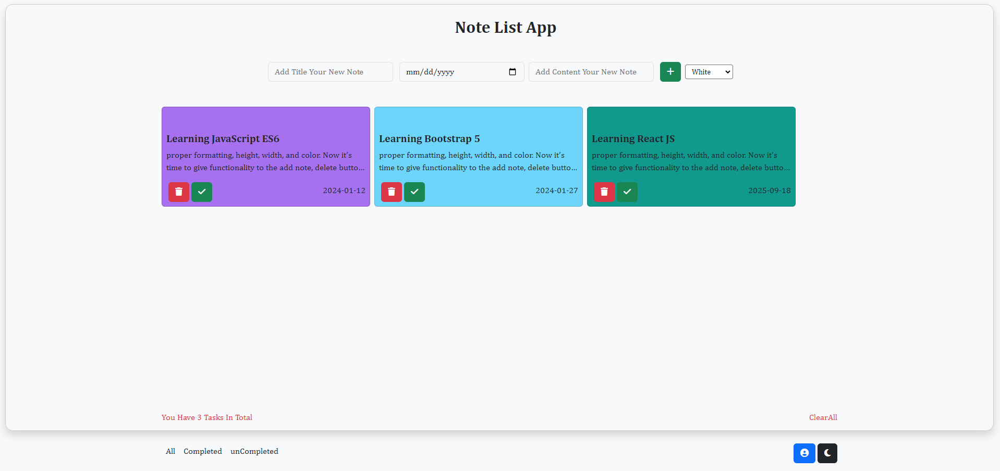
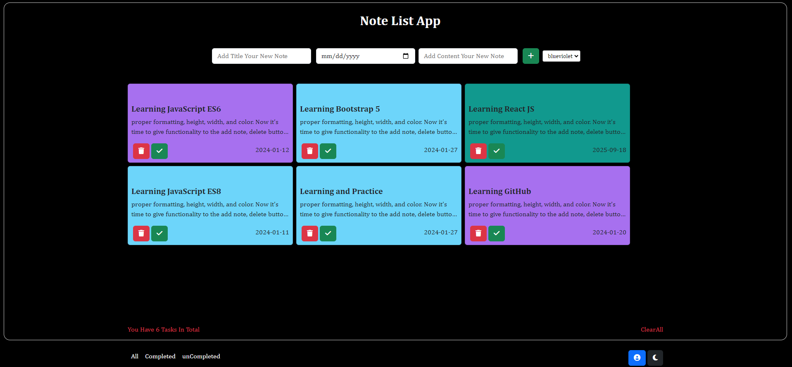

# Note Application 

Welcome to the Note Application! This simple web application allows you to manage your tasks and notes efficiently. Below, you'll find information about the code structure, functionality, and features of the application.

## Getting Started 


To use the Note Application, follow the steps below:

## Click on the link to run the project online 🧑‍💻
[Link to the Note application project View online](noteapp-aliazizi.netlify.app)


## Features ⭕

1. Open the application in your web browser.
2. Fill in the title, date, and content fields to add a new note.
3. Optionally, choose a background color for the note.
4. Click the "Add" button to create the note.
5. Use the filter buttons ("All," "Completed," "Uncompleted") to view specific sets of notes.
6. Toggle between light and dark themes using the "Change Theme" button.
7. Remove or mark notes as complete using the respective buttons.


## Demo Project 




```javascript
// Include this code in your project to set up the Note Applicatio

## Features
1. Add a New Note
Enter the title, date, and content in the corresponding input fields.
Click the "Add" button to create a new note.
Notes can be styled with different background colors.


2. Filter Notes
Use the filter buttons to categorize notes: "All," "Completed," or "Uncompleted."


3. Change Theme
Toggle between light and dark themes with the "Change Theme" button.
The chosen theme is saved to local storage for future visits.


4. Remove and Complete Notes
Remove a note by clicking the trash icon.
Mark a note as complete by clicking the checkmark icon.
Completed notes are visually distinguished from uncompleted ones.


5. Responsive Design
The application is designed to be responsive and user-friendly on various devices.


6. Input Validation
A modal is displayed if any of the input fields (title, date, content) is left empty.


## How to Use
Open the Note Application in your web browser.
Add a new note by filling in the title, date, and content fields.
Optionally, choose a background color for the note.
Click the "Add" button to create the note.
Use the filter buttons to view specific sets of notes.
Toggle between light and dark themes using the "Change Theme" button.
Remove or mark notes as complete using the respective buttons.


## Contributing
Feel free to contribute to the development of this Note Application by submitting issues or pull requests. Your feedback is highly appreciated!
